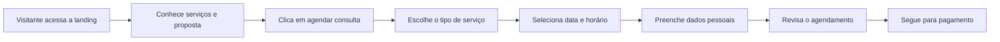
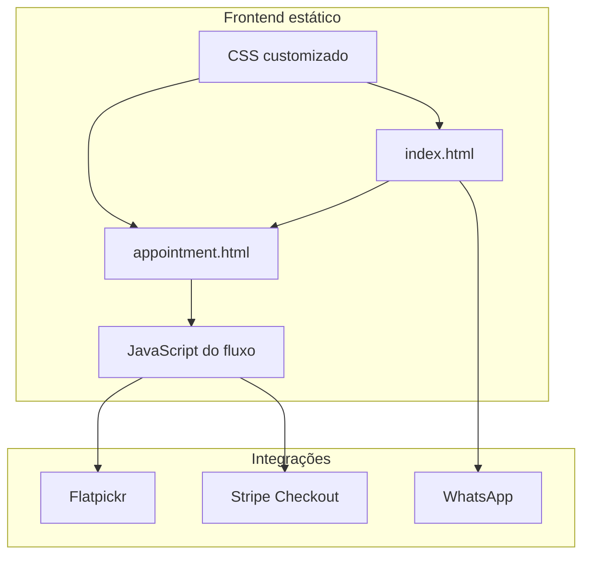

<div align="center">

# Easy Visa

### Landing page e fluxo de agendamento para consultoria de vistos e mobilidade internacional

<br>


**Projeto desenvolvido como estudo aplicado para uma consultoria de vistos, apresentado aqui como case de portfólio.**

[Página publicada](https://radekradke.github.io/Easy-Visa.teste/)

</div>

---

## Visão Geral

O **Easy Visa** é uma experiência digital para uma consultoria de vistos. O projeto combina uma landing page institucional com um fluxo de agendamento, pensado para conduzir o visitante desde o primeiro contato até a marcação de uma consulta.

A proposta foi criar uma interface com sensação profissional e acolhedora, porque o tema envolve planos importantes: estudo, trabalho, turismo, mudança de país e documentação. O usuário precisa entender o serviço, confiar na consultoria e avançar com clareza.

---

## Objetivo Do Projeto

O projeto foi criado para organizar a apresentação da consultoria e transformar interesse em ação.

Na prática, a experiência precisava:

- explicar os tipos de vistos atendidos;
- apresentar a Easy Visa e sua proposta de valor;
- destacar missão, visão e confiança;
- responder dúvidas comuns;
- permitir que o usuário inicie um agendamento;
- coletar serviço, data, horário e dados pessoais;
- revisar as informações antes do pagamento;
- preparar integração com checkout online.

---

## Funcionalidades

| Módulo | Recursos |
| --- | --- |
| **Landing page** | Hero, serviços, sobre, missão, visão, depoimento e FAQ |
| **Serviços** | Cards para turismo, estudo, trabalho e outras consultorias |
| **Modal informativo** | Base para detalhamento dos tipos de visto |
| **Agendamento** | Fluxo em etapas para escolher serviço, data, horário e dados pessoais |
| **Validação** | Campos obrigatórios e avanço controlado entre etapas |
| **Calendário** | Seleção de datas com Flatpickr |
| **Resumo** | Revisão das informações antes da confirmação |
| **Checkout** | Estrutura para redirecionamento ao Stripe |
| **Responsividade** | Layout adaptado para desktop e mobile |

---

## Fluxo De Agendamento



---

## Arquitetura Geral



---

## Stack Técnica

| Tecnologia | Uso no projeto |
| --- | --- |
| **HTML5** | Estrutura das páginas |
| **CSS3** | Layout, identidade visual e responsividade |
| **JavaScript Vanilla** | Navegação, validação e fluxo de agendamento |
| **Flatpickr** | Calendário interativo |
| **Stripe** | Base para checkout de pagamento |
| **Node.js / Express** | Estrutura prevista para criação de sessão de checkout |
| **Font Awesome** | Ícones da interface |
| **Google Fonts** | Tipografia e acabamento visual |

---

## Estrutura Do Projeto

```text
.
|-- index.html
|-- appointment.html
|-- confirmation.html
|-- css
|   |-- style.css
|   `-- appointment.css
|-- js
|   `-- appointment.js
|-- fotos
|   |-- SVG
|   |-- logos
|   `-- imagens da marca
|-- package.json
`-- README.md
```

---

## Minha Atuação

Neste projeto, trabalhei na criação da interface e na organização do fluxo que leva o usuário da apresentação da consultoria até o agendamento.

O cuidado principal foi deixar a jornada progressiva: primeiro o visitante entende o serviço, depois escolhe o tipo de atendimento, seleciona data e horário, informa os dados e revisa tudo antes de seguir.

Pontos trabalhados:

- estrutura da landing page;
- seções comerciais e institucionais;
- design visual da marca;
- cards de serviços;
- FAQ com foco em dúvidas reais;
- página de agendamento em múltiplas etapas;
- validação dos dados preenchidos;
- resumo final antes do pagamento;
- preparação para checkout online;
- responsividade.

---

## O Que Este Projeto Demonstra

| Competência | Aplicação |
| --- | --- |
| **Landing page comercial** | Apresentação clara de serviço e proposta de valor |
| **UX de conversão** | Jornada orientada para agendamento |
| **JavaScript vanilla** | Controle de etapas, estados, validações e resumo |
| **Integração externa** | Calendário e estrutura para pagamento com Stripe |
| **Design responsivo** | Interface adaptada para diferentes telas |
| **Produto digital** | Solução pensada para atendimento e captação de clientes |

---

## Nota De Portfólio

Este projeto é apresentado como estudo aplicado e case de portfólio. O foco está na construção da experiência, na organização do fluxo e na integração inicial de agendamento/pagamento, sem expor credenciais ou instruções sensíveis de ambiente.

<div align="center">

**Easy Visa - uma experiência digital para deixar o caminho do visto mais claro desde o primeiro clique.**

</div>
